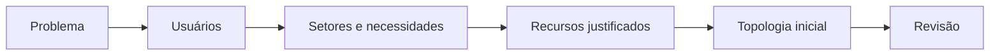
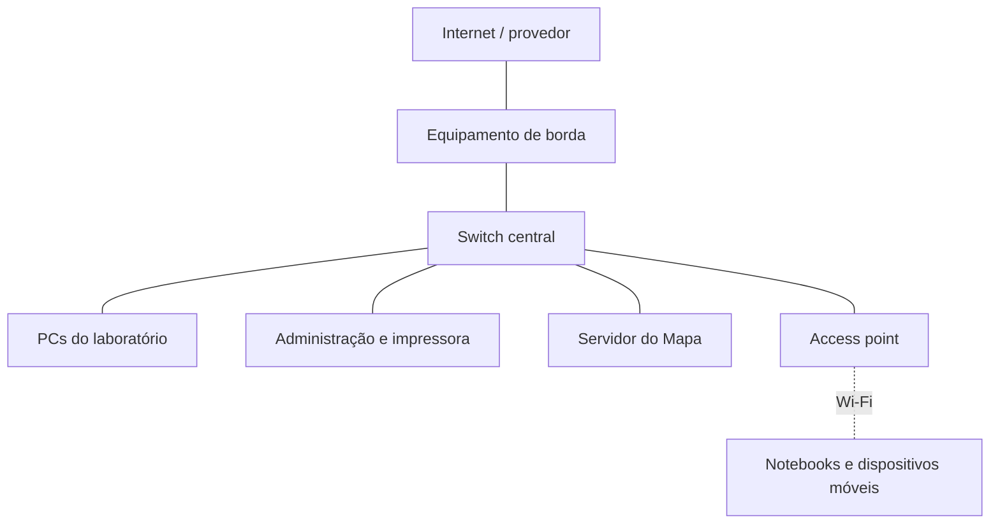
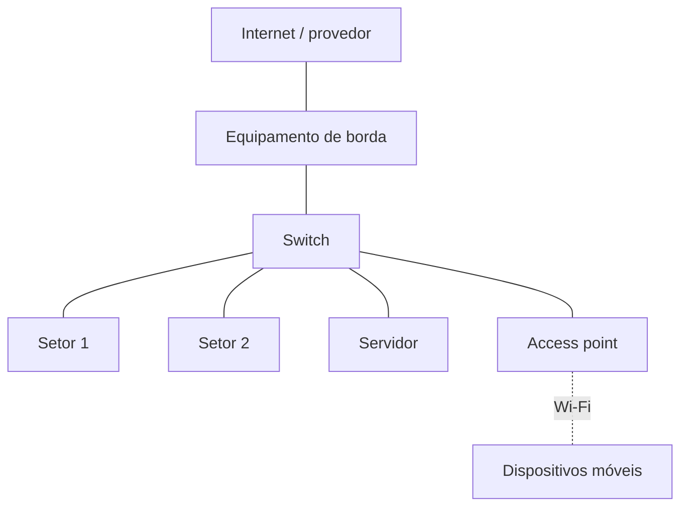

# Trilha guiada — Entrega D0: projeto inicial da rede

## Identificação

| Campo | Resposta da equipe |
|---|---|
| Nome da equipe | Equipe Conecta Escola |
| Integrantes | Gabriel Rodrigues, Pedro Eduardo, Marcus Antônio |
| Turma | Turma de Informática-Subsequente |
| Nome do projeto | Rede Comunitária Simples |
| Data | 16 de julho de 2026 |

---

## 1. Missão

Nesta entrega, sua equipe produzirá a **primeira hipótese documentada da rede**. Ela ainda poderá ser corrigida nas próximas aulas.

A D0 deve responder:

1. Qual problema precisa ser resolvido?
2. Quem utilizará ou administrará a rede?
3. Quais setores ou ambientes serão atendidos?
4. Quais recursos serão necessários e por quê?
5. Como esses recursos se conectarão em uma topologia inicial?

### Resultado esperado

Entregar:

- este arquivo Markdown preenchido;
- uma topologia legível;
- as premissas e dúvidas da equipe;
- o registro de uso de IA, caso tenha sido utilizada;
- opcionalmente, o arquivo `.pkt` e evidências do Packet Tracer.

> **Atenção:** a D0 não é o projeto final. Não é necessário configurar VLAN, roteamento, firewall, VLSM ou um plano IP completo.

---

## 2. Como realizar a atividade

### Tempo sugerido

| Etapa | Tempo |
|---|---:|
| Problema e usuários | 5 min |
| Setores e necessidades | 7 min |
| Recursos e justificativas | 8 min |
| Topologia inicial | 12 min |
| Revisão técnica | 8 min |
| Organização da entrega | tempo restante |

### Formatos permitidos

Sua equipe pode trabalhar de uma destas formas:

- Markdown com diagrama Mermaid;
- papel, com fotografia legível do resultado;
- Packet Tracer, se ele já estiver instalado e funcionando;
- combinação dos formatos anteriores.

Não instale software durante a oficina sem autorização do professor. A avaliação considera o raciocínio técnico, e não a ferramenta utilizada.

### Percurso essencial e extensões

Para concluir a D0 no tempo da oficina:

- **obrigatório:** seções 5 a 12, 19, 21, 22 e 23;
- **somente se a IA for utilizada:** seção 18;
- **se o professor solicitar e houver tempo:** seção 20, revisão por outra equipe;
- **extensão opcional com o simulador:** seções 13 a 17.

O uso do Packet Tracer não substitui o preenchimento do problema, usuários, setores, recursos, justificativas e premissas.

### Papéis sugeridos

| Papel | Responsabilidade | Integrante |
|---|---|---|
| Facilitador | controla o tempo e mantém a equipe na etapa atual | Estudante 1 |
| Relator | registra as respostas | Estudante 2 |
| Diagramador | organiza a topologia | Estudante 3 |
| Revisor técnico | confere coerência e lacunas | Todos juntos |

Se a equipe tiver menos de quatro integrantes, uma pessoa poderá assumir mais de um papel.

---

## 3. Caminho da D0



Não comece escolhendo equipamentos. Primeiro compreenda as pessoas e as atividades que a rede deverá apoiar.

---

## 4. Cenário acadêmico de referência

Caso o professor não determine outro cenário, considere o **Centro de Tecnologia e Memórias Comunitárias**, relacionado ao Mapa Interativo de Memórias Quilombolas.

Informações iniciais conhecidas:

- administração com 1 PC e 1 impressora de rede;
- laboratório com 20 PCs;
- professores usando notebooks por Wi-Fi;
- visitantes usando dispositivos móveis por Wi-Fi;
- servidor do Mapa de Memórias;
- acesso à Internet por enlace do provedor;
- necessidade futura de proteger os recursos internos do acesso de visitantes.

Este é um cenário didático. Não pesquise nem inclua senhas, endereços reais, detalhes da rede institucional ou informações pessoais.

### Cenário adotado pela equipe

> **Resposta da equipe:** Utilizaremos o cenário de uma pequena escola comunitária com um laboratório de informática simples.

**Preencher:**


---

# Parte A — Compreensão do problema

## 5. Escreva o problema

Um problema adequado descreve:

- o contexto;
- as pessoas afetadas;
- o que elas precisam fazer;
- a dificuldade atual.

### Não faça assim

> “Precisamos comprar dois switches e um roteador.”

Essa frase já escolheu equipamentos, mas ainda não explicou a necessidade.

### Estrutura de apoio

> No contexto de **[local]**, **[grupos de usuários]** precisam **[atividades ou serviços]**, mas **[dificuldade atual]**, o que prejudica **[impacto]**.

### Problema formulado pela equipe

> **Resposta da equipe — escreva um parágrafo:**
>
> Em uma escola de bairro, o laboratório de informática e a sala de administração precisam de uma rede local básica para que os PCs se comuniquem, a impressora funcione para todos e os professores possam acessar a internet. Hoje, a rede está montada de forma improvisada, com cabos soltos e poucos pontos de conexão, o que causa perda de tempo e impede o uso correto dos recursos.

### Verificação rápida

- [x] Identificamos o contexto.
- [x] Dissemos quem é afetado.
- [x] Explicamos o que as pessoas precisam realizar.
- [x] Evitamos começar pela compra de equipamentos.

---

## 6. Identifique os usuários

Usuário é um grupo de pessoas que utiliza ou administra a rede. Não confunda usuário com conta de login, computador ou setor.

| Grupo de usuários | Quantidade estimada | O que precisa fazer na rede | Prioridade |
|---|---:|---|---|
| Alunos | 20 | Acessar a internet para pesquisas e compartilhar arquivos das aulas. | alta |
| Professor | 2 | Acessar a internet para dar aulas e usar a impressora. | alta |
| Responsável pela sala | 1 | Manter os computadores funcionando e organizar os arquivos. | média |
| Visitantes | Variável (~10) | Acessar o Wi-Fi básico em seus celulares. | baixa |

### Quem administrará ou manterá a rede?

> **Resposta da equipe:** O responsável pela sala (administrador do laboratório) cuidará da manutenção básica.

---

## 7. Identifique os setores ou ambientes

Setor é uma área física ou organizacional. Exemplos: laboratório, administração, sala técnica e área de visitantes.

> **Setor não é sinônimo de sub-rede.** A separação lógica será estudada e decidida posteriormente.

| Setor ou ambiente | Usuários atendidos | Dispositivos previstos | Necessidades principais |
|---|---|---|---|
| Administração | Administrador | 1 PC, 1 Impressora | Trabalhos de escritório, impressão e internet. |
| Laboratório de informática | Alunos e Professores | 20 PCs, 1 Servidor | Aulas práticas, internet e compartilhamento de arquivos. |
| Área de visitantes | Visitantes | Celulares | Acesso rápido ao Wi-Fi. |

### Há ambientes, distâncias ou obstáculos que ainda precisam ser conhecidos?

> **Resposta da equipe:** Precisamos saber se as paredes do laboratório bloqueiam muito o sinal do Wi-Fi para a área de visitantes.

---

## 8. Liste necessidades e serviços

Uma **necessidade** descreve o que alguém precisa realizar. Um **serviço** é uma funcionalidade disponibilizada pela rede.

Exemplos de serviços:

- acesso à Internet;
- acesso ao Mapa de Memórias;
- impressão em rede;
- compartilhamento de arquivos;
- acesso sem fio;
- administração da infraestrutura.

| Usuário ou setor | Necessidade | Serviço relacionado | Importância | Como saberemos que funciona? |
|---|---|---|---|---|
| Alunos/Professor | Acessar sites para pesquisa | Internet | alta | Abrindo uma página da web nos PCs. |
| Administração/Professor | Imprimir documentos | Impressão em rede | alta | Enviando um documento do PC do laboratório para a impressora. |
| Laboratório | Guardar e baixar materiais | Servidor de arquivos | média | Acessando a pasta compartilhada no servidor. |
| Visitantes | Usar internet no celular | Wi-Fi básico | baixa | Conectando o celular na rede sem fio e navegando. |

---

# Parte B — Da necessidade à proposta

## 9. Selecione recursos e justifique

Cada recurso listado deve atender a uma necessidade identificada anteriormente.

### Lembrete de funções

| Recurso | Função principal neste nível do projeto |
|---|---|
| Switch | conecta dispositivos cabeados dentro da LAN |
| Roteador | interliga redes e permite alcançar destinos externos |
| Access point | oferece acesso sem fio à rede local |
| Servidor | disponibiliza serviços e dados aos clientes |
| ONT/modem do provedor | termina ou adapta o enlace entregue pelo provedor |
| Firewall | controla tráfego conforme regras de segurança; pode estar integrado a outro equipamento |
| Cabo de cobre | conecta dispositivos cabeados em distâncias compatíveis |
| Fibra óptica | atende enlaces que justifiquem maior distância, capacidade ou imunidade a interferência |

### Recursos propostos

| Recurso | Quantidade inicial | Necessidade atendida | Justificativa | Dúvida ou premissa |
|---|---:|---|---|---|
| Roteador/Modem | 1 | Acesso à internet | Recebe o sinal do provedor de internet e repassa para a escola. | Já temos um fornecido pela operadora? |
| Switch (24 portas) | 1 | Conectar os PCs com cabo | Interliga os computadores do laboratório, o servidor e a impressora. | 24 portas são suficientes para o futuro? |
| Access Point | 1 | Wi-Fi para visitantes/professores | Permite conexão sem fio para notebooks e celulares. | Qual a distância que o sinal alcança? |
| Impressora de rede | 1 | Impressão de materiais | Atende à administração e aos professores no laboratório. | Ela tem entrada para cabo de rede? |
| Servidor local | 1 | Guardar arquivos | Centraliza os materiais de aula para acesso rápido. | Um PC comum serve como servidor simples? |
| Cabos de cobre (UTP) | Vários | Conexão física | Liga tudo ao switch de forma estável. | Qual o tamanho exato dos cabos necessários? |

### Conferência de capacidade

1. Quantas conexões cabeadas são necessárias inicialmente?

> **Resposta:** 20 PCs + 1 PC Administração + 1 Servidor + 1 Impressora + 1 Access Point + 1 Roteador = 25 conexões cabeadas.

2. Quantas portas deverão ficar livres para expansão?

> **Resposta:** Seria bom ter pelo menos umas 5 portas livres para novos computadores no futuro.

3. A quantidade de portas dos switches propostos é suficiente? Demonstre a conta.

> **Resposta e cálculo:** O nosso switch tem 24 portas, mas precisamos de 25. Vamos precisar de um switch maior (ex: 48 portas) ou dois switches de 24 portas interligados.

4. Quais usuários necessitam de Wi-Fi?

> **Resposta:** Os professores (usando notebooks) e os visitantes (usando celulares).

5. A quantidade de access points é conhecida ou ainda depende de levantamento de área, obstáculos e quantidade de usuários?

> **Resposta:** A princípio 1 access point, mas depende do tamanho da escola e das paredes de tijolos.

---

## 10. Registre premissas e perguntas em aberto

Não invente uma informação que não foi fornecida. Registre-a.

| Tipo | Premissa ou pergunta | Por que importa? | Como será confirmada? |
|---|---|---|---|
| pergunta | O switch de 24 portas será suficiente? | Se faltar porta, alguns PCs ficarão sem rede. | Revendo a contagem de equipamentos. |
| premissa | A impressora já possui conexão de rede. | Sem isso, ela não pode ser compartilhada por todos facilmente. | Olhando o modelo físico da impressora. |
| pergunta | O provedor de internet já instalou a fibra/modem? | Sem ele, não teremos acesso à web. | Perguntando à direção da escola. |

---

# Parte C — Topologia inicial

## 11. Desenhe a topologia

A topologia deve permitir que outra pessoa reconheça:

- onde a rede recebe o enlace externo;
- qual equipamento interliga a rede interna à rede externa;
- onde os dispositivos cabeados se concentram;
- onde está o servidor;
- como os clientes sem fio entram na rede;
- quais elementos pertencem a cada setor.

### Exemplo didático simplificado



Esse é apenas um exemplo de leitura. A equipe deve adaptar a topologia às necessidades e aos recursos que registrou.

### Modelo Mermaid para copiar e editar

Copie o bloco abaixo, substitua os textos e acrescente ou remova elementos. Mantenha identificadores curtos e únicos antes dos colchetes.

````text

````

### Topologia da equipe

Substitua este espaço pelo diagrama Mermaid, pela imagem do desenho ou por uma captura legível do Packet Tracer.

> **Inserir topologia aqui:**


### Explique a leitura da topologia

1. Por onde o tráfego entra e sai da rede?

> **Resposta:** Entra e sai pelo Roteador/Modem conectado à Internet.

2. Qual é o ponto central das conexões cabeadas?

> **Resposta:** O Switch. Todos os cabos se encontram nele.

3. Onde o servidor está conectado?

> **Resposta:** O servidor está ligado diretamente ao Switch por um cabo.

4. Como os dispositivos sem fio entram na LAN?

> **Resposta:** Através do Access Point (AP), que distribui o sinal Wi-Fi.

5. Quais decisões de segurança ainda não estão representadas?

> **Resposta:** Ainda não definimos as senhas do Wi-Fi nem como separar a rede dos visitantes da rede dos alunos.

---

## 12. Checklist técnico da topologia

- [x] Todo equipamento listado aparece no desenho, ou a ausência foi justificada.
- [x] Todo elemento desenhado aparece na lista de recursos.
- [x] Os cabos chegam exatamente aos equipamentos.
- [x] O switch concentra os dispositivos cabeados.
- [x] O servidor está conectado ao switch, e não entre o switch e os clientes.
- [x] O access point está ligado à rede cabeada.
- [x] Os clientes Wi-Fi se conectam ao access point.
- [x] Existe um equipamento responsável por interligar a LAN à rede externa quando há Internet.
- [x] Se houver firewall separado, ele está no caminho do tráfego. (Não se aplica neste cenário básico)
- [x] Não afirmamos que setores já são sub-redes.
- [x] O desenho está legível e não possui linhas ou rótulos ambíguos.

### Correções feitas após o checklist

> **Resposta da equipe:**


---

# Parte D — Validação opcional no Cisco Packet Tracer

## 13. Quando utilizar o simulador

Esta etapa é **opcional na D0**. Realize-a somente se o Packet Tracer já estiver disponível e autorizado no laboratório.

O simulador pode ajudar a:

- conferir se os equipamentos estão conectados;
- verificar se as interfaces estão ativas;
- reaproveitar a LAN construída na Aula 3;
- testar `ping` entre dispositivos locais;
- observar eventos ARP e ICMP como preparação para a próxima aula.

Se o programa não estiver disponível, avance para a Parte E. Não faça instalação durante a oficina.

---

## 14. Monte ou adapte a topologia no Packet Tracer

### Opção recomendada

Abra o arquivo `.pkt` produzido na Aula 3 e salve uma cópia com outro nome:

```text
D0-equipe-nome-do-projeto.pkt
```

### Caso seja necessário recriar a LAN básica

1. Em **End Devices**, adicione os PCs e um servidor.
2. Em **Network Devices → Switches**, adicione um switch, como o 2960 disponível no simulador.
3. Em **Connections**, use **Automatically Choose Connection Type** ou **Copper Straight-Through**.
4. Conecte `FastEthernet0` de cada PC/servidor a uma porta Ethernet livre do switch.
5. Aguarde os indicadores das portas ficarem ativos.
6. Renomeie os dispositivos para que o desenho seja compreensível.

> **Dica:** não use roteador somente para fazer dois hosts da mesma sub-rede se comunicarem. A LAN básica da Aula 3 funciona com PCs, servidor e switch.

### Plano de teste opcional

Use estes endereços somente para validar a LAN reaproveitada da Aula 3; eles não constituem o plano IP completo da D0.

| Dispositivo | IPv4 | Máscara | Gateway neste teste local |
|---|---|---|---|
| PC0 | `192.168.10.10` | `255.255.255.0` | deixar vazio |
| PC1 | `192.168.10.11` | `255.255.255.0` | deixar vazio |
| Servidor | `192.168.10.20` | `255.255.255.0` | deixar vazio |

Configure cada equipamento em **Desktop → IP Configuration**.

### Registro da montagem

| Verificação | Resultado/observação |
|---|---|
| Dispositivos adicionados | Foram inseridos 2 PCs, 1 Servidor e 1 Switch para teste básico. |
| Portas utilizadas | Portas FastEthernet 0/1 até 0/3 do Switch. |
| Estado visual dos enlaces | As bolinhas ficaram verdes após alguns segundos. |
| Nome do arquivo salvo | D0-equipe-conecta-escola.pkt |

---

## 15. Comandos de verificação nos PCs

Abra um PC e acesse **Desktop → Command Prompt**.

### Ver endereço configurado

```console
ipconfig
```

> **O endereço exibido corresponde ao planejamento?**

**Resposta:** Sim, o endereço 192.168.10.10 apareceu certinho.

### Testar PC1

No PC0:

```console
ping 192.168.10.11
```

> **O teste foi bem-sucedido? Copie ou resuma o resultado.**

**Resposta:** Sim, o ping respondeu com sucesso: "Reply from 192.168.10.11".

### Testar o servidor

No PC0:

```console
ping 192.168.10.20
```

> **O teste foi bem-sucedido? O que esse resultado comprova e o que ele não comprova?**

**Resposta:** O ping funcionou. Isso comprova que os cabos e o switch estão comunicando. Não comprova se o serviço de arquivos está configurado corretamente.

### Consultar a tabela ARP do PC

Depois do `ping`, tente:

```console
arp -a
```

> **Quais endereços IPv4 e MAC aparecem associados?**

**Resposta:**


> **Observação:** se a versão disponível do simulador não aceitar esse comando, registre a limitação e use o modo Simulation para observar ARP.

---

## 16. Comandos de observação no switch

Clique no switch e abra a aba **CLI**. Estes comandos apenas consultam o estado; não é necessário configurar o switch nesta D0.

```text
enable
show mac address-table
show interfaces status
```

Se `show interfaces status` não estiver disponível na versão utilizada, tente:

```text
show interfaces
```

### Respostas

1. Quais endereços MAC foram aprendidos pelo switch?

> **Resposta:** Os endereços físicos (MAC) dos computadores que fizemos o teste do ping.

2. Em quais portas eles aparecem?

> **Resposta:**

3. A tabela estava vazia antes dos testes? O que mudou depois do `ping`?

> **Resposta:** Estava vazia. Depois do ping, o switch registrou onde cada computador estava conectado.

4. Alguma interface utilizada aparece inativa? Qual?

> **Resposta:**

---

## 17. Observe ARP e ICMP no modo Simulation

1. Mude de **Real-Time** para **Simulation**.
2. Em **Edit Filters**, deixe visíveis somente **ARP** e **ICMP**.
3. Limpe eventos anteriores, se necessário.
4. Gere um `ping` pelo Command Prompt ou use **Add Simple PDU**.
5. Se utilizar **Add Simple PDU**, clique primeiro no dispositivo de origem e depois no destino.
6. Use **Capture/Forward** para avançar um evento por vez.
7. Clique nos eventos da lista para observar os detalhes da PDU.
8. Ao concluir, use **Reset Simulation** ou retorne ao modo Real-Time.

### Observações da equipe

1. Qual protocolo apareceu primeiro: ARP ou ICMP?

> **Resposta:**

2. Qual pergunta o ARP tentou responder?

> **Hipótese da equipe:**

3. Quais dispositivos receberam o primeiro evento ARP?

> **Resposta:**

4. Quais dispositivos efetivamente responderam ao `ping`?

> **Resposta:**

5. Insira uma captura ou descreva o evento mais importante.

> **Evidência/descrição:**

---

# Parte E — Revisão e entrega

## 18. Use IA generativa com responsabilidade

| Campo | Resposta |
|---|---|
| Ferramenta utilizada | Nenhuma / Não utilizamos. |
| Prompt utilizado | N/A |
| Sugestões aceitas | N/A |
| Sugestões rejeitadas | N/A |
| Como verificamos as sugestões | N/A |
| Correções feitas pela equipe | N/A |

## 19. Justifique a proposta

**Justificativa da equipe:**

A nossa proposta atende à escola porque organiza os cabos e conecta todos os computadores de forma limpa usando um Switch central. Escolhemos o Switch porque ele permite que todos falem com o Servidor ao mesmo tempo sem lentidão. O Access Point foi colocado para resolver a falta de conexão sem fio dos professores e visitantes. A topologia mostra claramente o Switch no meio, com o Roteador ligando à internet de um lado, e o Laboratório e a Administração do outro. Uma decisão provisória foi trocar o Switch de 24 portas para um de 48, pois notamos que faltariam portas. No futuro, precisaremos estudar como colocar uma senha no Wi-Fi para separar a rede dos visitantes.

## 21. Checklist final de aceitação

### Conteúdo
- [x] O problema informa contexto, usuários, necessidade e dificuldade.
- [x] Os grupos de usuários foram identificados.
- [x] Os setores ou ambientes foram descritos.
- [x] As necessidades e os serviços foram registrados.
- [x] Os recursos têm quantidade inicial, função e justificativa.
- [x] Premissas e perguntas em aberto foram registradas.

### Topologia
- [x] A topologia pode ser compreendida sem explicação oral.
- [x] Os equipamentos listados e desenhados são consistentes.
- [x] Os dispositivos cabeados e sem fio estão conectados coerentemente.
- [x] A conexão com a rede externa está representada, quando necessária.
- [x] O desenho não confunde setor com sub-rede.

### Qualidade da entrega
- [x] O arquivo está legível.
- [x] A equipe revisou ortografia e nomes técnicos.
- [x] O uso de IA foi registrado, se ocorreu.
- [x] Nenhum dado sensível foi incluído.
- [x] O arquivo foi salvo com o nome correto.

## 23. Síntese da equipe

**Principal decisão tomada**

Resposta: Mudar a ideia de um switch de 24 portas para um de 48 portas para não faltar conexão.

**Maior dúvida ainda existente**

Resposta: Como vamos proteger os arquivos da escola caso um visitante tente acessá-los pelo Wi-Fi.

**O que esperamos compreender na próxima aula**

Resposta: Aprender a configurar as sub-redes ou senhas para criar a separação de segurança entre visitantes e alunos.
